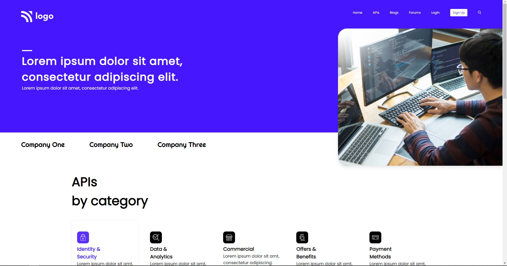

# Assignment 1

- Skills Gained in this project
  - learned a lot about aligning all elements using css which learnt while doing other projects. 
---

## Time taken to finish this project

- 7 hours taken to complete it.
## Project 9 [Live Link](https://lco-pjt9.netlify.app)
#### Preview

